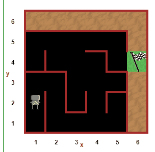

# Day 6 

## List of Challenges

Challenge 1 (Square Challenge) - https://reeborg.ca/reeborg.html?lang=en&mode=python&menu=worlds%2Fmenus%2Freeborg_intro_en.json&name=Alone&url=%2Fworlds%2Ftutorial_en%2Falone.json
Challenge 2 (Hurdle 1 Challenge) - https://reeborg.ca/reeborg.html?lang=en&mode=python&menu=worlds%2Fmenus%2Freeborg_intro_en.json&name=Hurdle%201&url=worlds%2Ftutorial_en%2Fhurdle1.json
Challenge 3 (Hurdle 2 Challenge) - https://reeborg.ca/reeborg.html?lang=en&mode=python&menu=worlds%2Fmenus%2Freeborg_intro_en.json&name=Hurdle%202&url=worlds%2Ftutorial_en%2Fhurdle2.json
Challenge 4 (Hurdle 3 Challenge) - https://reeborg.ca/reeborg.html?lang=en&mode=python&menu=worlds%2Fmenus%2Freeborg_intro_en.json&name=Hurdle%203&url=worlds%2Ftutorial_en%2Fhurdle3.json
Challenge 5 (Hurdle 4 Challenge) - https://reeborg.ca/reeborg.html?lang=en&mode=python&menu=worlds%2Fmenus%2Freeborg_intro_en.json&name=Hurdle%204&url=worlds%2Ftutorial_en%2Fhurdle4.json

## Escaping the Maze Project

Project (Escaping the maze) - https://reeborg.ca/reeborg.html?lang=en&mode=python&menu=worlds%2Fmenus%2Freeborg_intro_en.json&name=Maze&url=worlds%2Ftutorial_en%2Fmaze1.json

